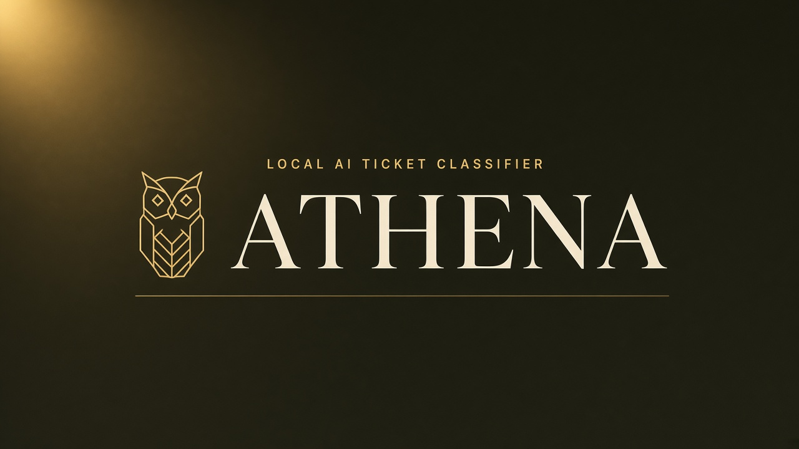
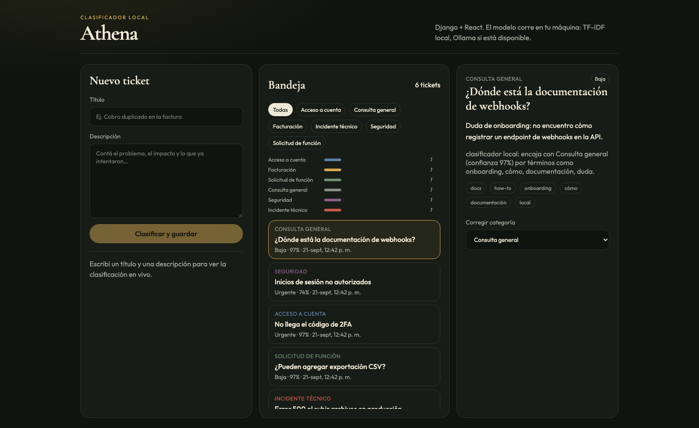
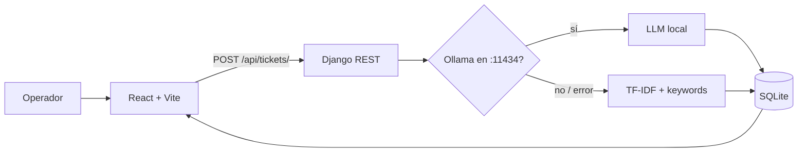
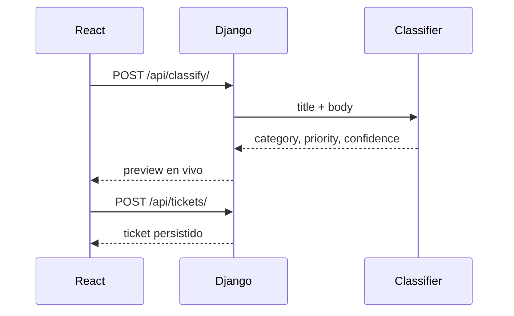

<p align="center">
  
</p>

<p align="center">
  
  
  
  
  
</p>

<p align="center">
  <strong>Clasificá tickets de soporte en tu máquina.</strong><br/>
  Sin nube. Sin API keys. Sin GPU.
</p>

<p align="center">
  <a href="#quick-start">Quick start</a> ·
  <a href="#cómo-clasifica">Cómo clasifica</a> ·
  <a href="#api">API</a>
</p>

---

<p align="center">
  
</p>

Pegá un título y una descripción: Athena etiqueta **categoría**, **prioridad**, **tags** y **confianza**. Si se equivoca, lo corregís a mano.

## Arquitectura

<p align="center">
  
</p>



## Cómo clasifica

<p align="center">
  
</p>

1. El **título se cuenta dos veces** junto al cuerpo, para que el asunto pese más.
2. **TF-IDF** (n-gramas 1–2) mide similitud coseno contra prototipos en español e inglés.
3. Los **keywords** de cada categoría suman un boost y se convierten en tags.
4. La **prioridad** sale del lenguaje de urgencia (`outage`, `caído`, `breach`, `2FA`…).
5. La **confianza** es el margen entre el 1.º y el 2.º puesto.

Si Ollama está en `localhost:11434`, Athena lo intenta primero y cae al modelo local ante cualquier fallo.

### Puntajes de un ticket real

> *“Nos cobraron dos veces el plan”* → **Facturación · 97%**

<p align="center">
  
</p>

## Categorías

<p align="center">
  
</p>

| Categoría | Qué entra |
| --- | --- |
| **Facturación** | cobros, facturas, reembolsos, planes |
| **Incidente técnico** | errores, caídas, bugs, timeouts |
| **Solicitud de función** | mejoras, roadmap, “sería útil” |
| **Acceso a cuenta** | login, 2FA, permisos, reset |
| **Seguridad** | accesos no autorizados, fugas, phishing |
| **Consulta general** | docs, onboarding, “cómo hago” |

## Quick start

```bash
make install
make migrate
make seed
```

Dos procesos:

```bash
make backend    # http://127.0.0.1:8000
make frontend   # http://127.0.0.1:5173
```

Abrí **http://127.0.0.1:5173**. Vite proxea `/api` a Django.



## API

| Método | Path | Para qué |
| --- | --- | --- |
| `GET` | `/api/categories/` | catálogo |
| `GET` | `/api/tickets/` | bandeja |
| `POST` | `/api/tickets/` | crear + clasificar |
| `POST` | `/api/classify/` | preview sin guardar |
| `POST` | `/api/tickets/:id/correct/` | override humano |
| `GET` | `/api/stats/` | totales de la bandeja |

---

<p align="center">
  <sub>Hecho para correr 100% local · Django + Poetry · React + pnpm Vite</sub>
</p>
